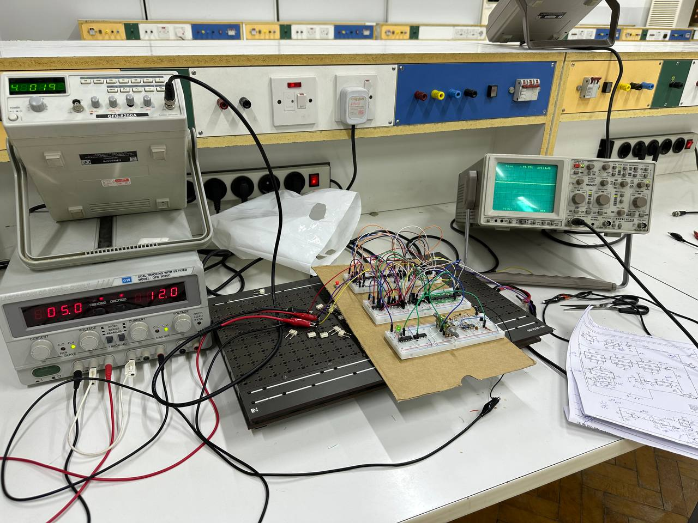

# DSSS Lab

**A 2 MHz hardware demonstration, extended into a reproducible Python and MATLAB communications laboratory.**

I built and tested a direct-sequence spread-spectrum (DSSS) link as an individual university project, following André Kesteloot's design in *QEX*, December 1986. This repository brings together my Multisim files, laboratory photographs, original report, and a new software study of the link's behaviour under noise, interference and receiver impairments.



The hardware work covers PN generation, XOR spreading and square-carrier BPSK, code alignment, and analogue data recovery. The software extends the project to framed text, PCM samples, BER measurements, acquisition, pulse shaping and channel impairments. See the [hardware/software boundary](docs/implementation-matrix.md) before interpreting a result as a physical measurement.

## Start here

| Goal | Open |
|---|---|
| Understand the signal chain and assumptions | [Methodology](docs/methodology.md) |
| Inspect results and their limitations | [Results](docs/results.md) |
| Run the project on Windows | [Getting started](docs/getting-started.md) |
| See my original hardware evidence | [Hardware evidence](hardware/README.md) |
| Check the original report's corrections | [Technical errata](docs/errata.md) |
| Understand the source design and my contribution | [Attribution](docs/attribution.md) |
| Assess the unfinished PCB | [PCB audit and design plan](hardware/audit/pcb-review.md) |

## Run Python

From the repository root, using Python 3.10 or later:

```bash
python -m pip install -e .
python -m unittest discover -s tests -v
python examples/burst_link.py
python -m dsss_lab.experiments
python examples/pulse_shaping.py
```

For a smaller run, add `--quick` to the experiment command. CSV files, figures and environment metadata are written to `results/`. Running without installing is also possible with `PYTHONPATH=src` on Linux/macOS; see the Windows guide for PowerShell.

## Run MATLAB

No Communications Toolbox is required. From the repository root:

```matlab
addpath('matlab');
test_dsss;
run_experiments('results/matlab', 12000);
advanced_demo('results/matlab');
```

MATLAB shares deterministic test vectors with Python. Random-number streams differ, so Monte Carlo results should agree statistically, not bit-for-bit. **The Python suite has been executed locally. MATLAB and GNU Octave execution is pending**; workflows are included to perform those checks after publication.

## What the software explores

| Area | Implemented experiments |
|---|---|
| Data | Random bits, constants, alternating patterns, bursts, UTF-8 text, 8-bit PCM, CRC32 frames |
| Spreading | Exact hardware XNOR recurrence, code phase, autocorrelation, configurable spreading length, two-user Gold-family interference |
| Channels | AWGN; in-band and out-of-band tones; swept interference; burst noise; multipath; symbol-independent Rayleigh fading |
| Receiver | Coherent despreading, known-preamble delay/CFO acquisition, burst phase correction, known-channel matched combining |
| Front end | Carrier offset, phase offset/noise, fractional timing error, ADC clipping/quantization, IQ imbalance, RRC pulse shaping |
| Measurements | BER with Wilson intervals, frame CRC failure rate, acquisition success, raw decision EVM, Welch PSD and 99% occupied bandwidth |
| Coding | Soft repetition decoding with equal information-bit energy as a normalization check |

## A result worth understanding


At equal information-bit energy, DSSS and ordinary coherent BPSK have the same theoretical BER in AWGN. Spreading's interference behaviour depends on the interferer's spectrum and the receiver. The experiments include cases where DSSS helps and cases where the narrower unspread receiver performs better.


The checked-in run uses 60,000 bits per AWGN point and 30,000 bits per interference point. It is a simulation, with ideal timing except in explicitly impaired experiments. Source CSVs and seeds are included; zero observed errors do not establish zero BER.

## Hardware status

The original breadboard was tested using a shared reference and wired transmitter-to-receiver connection. The KiCad files are an **unrouted placement study**, preserved as historical work. They are not fabrication files. No new PCB or RF field trial is claimed.

## Attribution and maintenance

Original circuit: André Kesteloot, N4ICK, “Experimenting With Direct-Sequence Spread Spectrum,” *QEX*, December 1986, pp. 5–9. Individual university implementation: **Mohamed Abuain**. The later software extension was developed with AI assistance and is separately documented.

The full magazine issue is not redistributed. The original report and hardware files retain their own provenance; the repository's software licence does not apply to third-party material. See [attribution](docs/attribution.md), [licensing](LICENSE.md), [changelog](CHANGELOG.md) and [roadmap](docs/roadmap.md).
