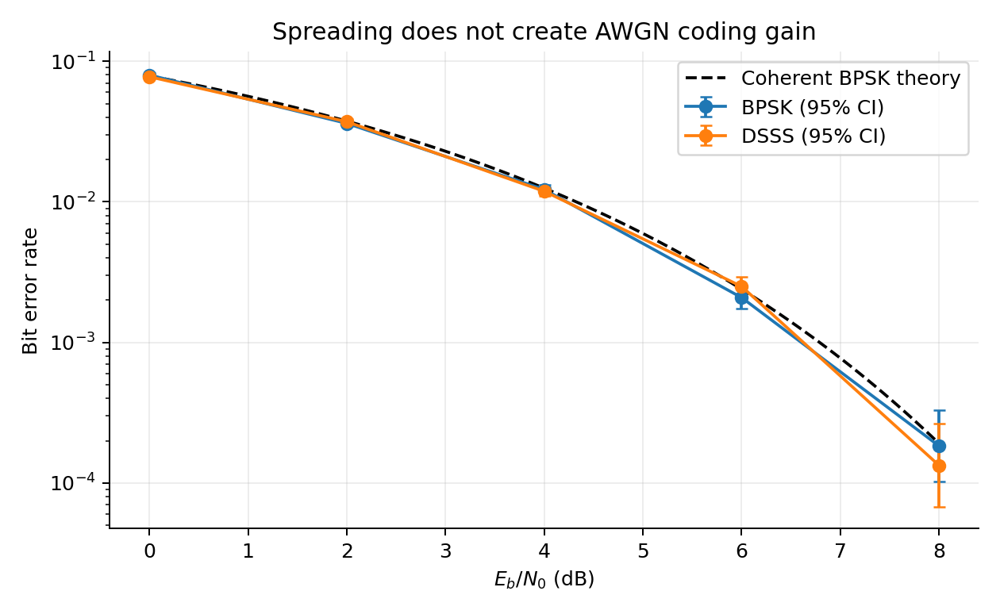
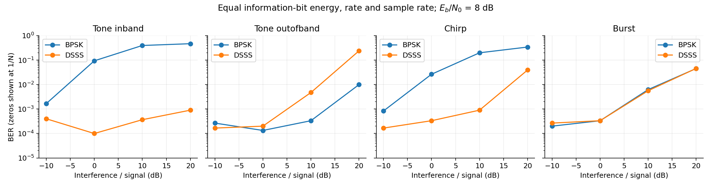
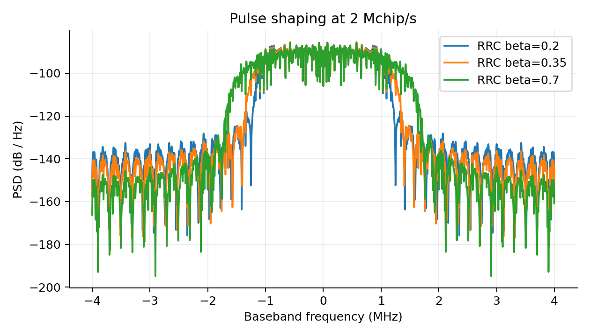

# Results from the initial Python run

All results on this page are **simulated**, not new hardware measurements. The main seed is 20260920. Full environment metadata is stored in `../results/run_metadata.json`; the pulse-shaping example uses seed 99.

## Noise baseline

The run uses 60,000 bits at each Eb/N0 point. Both receivers use equal information-bit energy, bit rate and sample rate. Confidence intervals and error counts are retained in [awgn.csv](../results/awgn.csv).

| Eb/N0 (dB) | Theoretical BPSK BER | BPSK simulated BER | DSSS simulated BER |
|---|---|---|---|
| 0 | 0.0786496 | 0.0797667 | 0.0775667 |
| 2 | 0.0375061 | 0.0361333 | 0.0371333 |
| 4 | 0.0125008 | 0.0122333 | 0.0118833 |
| 6 | 0.00238829 | 0.00208333 | 0.0025 |
| 8 | 0.000190908 | 0.000183333 | 0.000133333 |

## Interference

At Eb/N0 = 8 dB, each interference point uses 30,000 bits. The following examples all use J/S = +10 dB; frequency placement changes the outcome.

| Interferer | BPSK BER | DSSS BER |
|---|---|---|
| tone_inband | 0.395333 | 0.000366667 |
| tone_outofband | 0.000333333 | 0.00473333 |
| chirp | 0.198733 | 0.0009 |
| burst | 0.00623333 | 0.0056 |

The in-band tone demonstrates rejection by despreading. The out-of-band tone demonstrates the benefit of the narrower unspread receiver. These are conditional examples, not a universal anti-jamming claim. See [interference.csv](../results/interference.csv) and the exact frequencies in [methodology](methodology.md).

## Acquisition

Known 16-bit preamble, 127 chips/bit, 65 integer delay candidates, and three on-grid CFO candidates. These are probabilities over the stated simulation trials, not measured hardware acquisition times.

| Eb/N0 (dB) | Correct joint delay/CFO estimates | Trials | Success rate |
|---|---|---|---|
| -5 | 47 | 100 | 47.0% |
| 0 | 97 | 100 | 97.0% |
| 5 | 100 | 100 | 100.0% |

The [burst example](../examples/burst_link.py) recovers a CRC-protected text message after a simulated 29-sample delay, +0.0002 cycles/sample CFO and 0.83-radian phase offset. Acquisition estimates phase from the noisy preamble. There is no off-grid tracker or false-alarm-controlled detector.

## Pulse shaping

RRC shaping uses four samples/chip, a 10-chip filter span and a 2 Mchip/s chip rate. Occupied bandwidth below contains 99% of the estimated PSD power. Noise tests use 4,000 bits per point; those counts are too small for precise low-BER comparisons between roll-off values.

| RRC roll-off | 99% occupied bandwidth (MHz) | Observed errors / bits |
|---|---|---|
| 0.2 | 2.156 | 2 / 4000 |
| 0.35 | 2.316 | 1 / 4000 |
| 0.7 | 2.836 | 0 / 4000 |

## Other outputs

| CSV | Experiment |
|---|---|
| `payloads.csv` | Random, pattern, text and PCM bit recovery |
| `packets.csv` | CRC frame failures versus Eb/N0 |
| `impairments.csv` | Uncompensated phase/CFO/timing, phase noise, ADC and IQ sensitivity |
| `multipath.csv` | Single-finger versus exact-known-channel matched combining |
| `rayleigh.csv` | Symbol-independent fading with perfect CSI |
| `near_far.csv` | Synchronous two-user interference with a second Gold-family sequence |
| `repetition.csv` | Three-copy soft decoding with energy normalized per information bit |
| `pn_sequence.csv`, `pn_acf.csv` | Exact recurrence and correlation |
| `spectrum.csv` | Rectangular-pulse PSD-derived bandwidth |
| `hardware_trace_excerpt.csv` | Short ideal digital trace; not a measured scope export |

All paths above are under `results/`. Zero observed errors are reported with a finite confidence upper bound where BER metrics are used. Multipath taps and fading CSI are idealized; do not interpret those plots as a deployed receiver's performance.

## Validation status

The Python unit suite has 17 passing tests. It covers PN period/table, autocorrelation, energy, noiseless recovery, theoretical BER, CRC, acquisition, channel alignment, interference power, repetition normalization, impairment identities, confidence intervals, invalid inputs, PSD power, RRC recovery and burst decoding. The same Python checks and a GNU Octave execution of `test_dsss`, `run_experiments` and `advanced_demo` passed in GitHub Actions on 21 September 2026; both jobs produced downloadable result artifacts.

GNU Octave and native MathWorks MATLAB have both validated the MATLAB-compatible implementation, including the shared deterministic vectors. The first native run used MATLAB build `2026.1.999`, completed all assertions and experiment runners, and uploaded the generated results as a GitHub Actions artifact.
