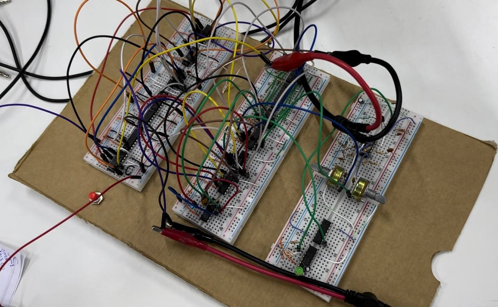

# Original hardware implementation

Individual university work by Mohamed Abuain, based on André Kesteloot's QEX design (December 1986, pp. 5–9).

The circuit uses a shared reference, PN generators in transmitter and receiver, XOR logic for spreading and square-carrier BPSK, comparator-driven acquisition, a latch and clock switch, and an LM/MC1496 balanced demodulator. Transmitter and receiver were connected by a wire. The photographs support a working laboratory demonstration; they do not contain digital sample exports suitable for recomputing BER or precise SNR.

## Archived files

| File | Status |
|---|---|
| `original/DSSS_MAbuain.ms14` | Main supplied Multisim 14 project; not rerun in this environment |
| `original/GOLD1.ms14` | Additional supplied Multisim project; purpose not independently established |
| `original/MC1496_split_Gilbert_Cell_Test.asc` | Supplied LTspice demodulator test schematic; dependencies not fully audited |
| `original/dsss.kicad_*` | Latest supplied April backup; unrouted layout study |
| `../docs/original-report.pdf` | Preserved report; read the errata alongside it |

## Measurement evidence

| Image | What can safely be inferred |
|---|---|
| [Lab setup](../assets/lab-15.jpg) | Board connected to laboratory equipment |
| [Board close-up](../assets/lab-20.jpg) | Multi-breadboard implementation |
| [Logic waveforms](../assets/lab-11.jpg) | Captured digital waveforms; precise node labels require the report/setup notes |
| [Spectrum](../assets/lab-14.jpg) | Frequency-domain observation; no raw trace or full analyzer settings supplied |
| [Recovered-signal observation](../assets/lab-01.jpg) | Waveform evidence consistent with the report; distortion remains visible |

The photos are not converted into invented raw samples. New simulation plots are stored separately under `results/figures/`.
